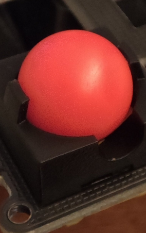

# 14mmマウスセンサーモジュール

14x8mmサイズのマウスセンサーモジュールです。

超省電力ワイヤレスマウスセンサーであるPAW3222を使用しています。動作電流はPMW3610の半分以下となっています。（PMW3610: 0.60mA, 本モジュール: 0.27mA, データシートより）

3線SPIでの動作のほか、CSをGNDに固定して2線SPIで通信することもできます。
MOTION出力も備えています。

[BOOTHにて販売中](https://nogikes.booth.pm/items/6520217)

## ピン配置

0.5mmピッチ、6ピンのFPCで接続します。
同一電極面のFPCを使う場合、対向する側のコネクタでピン順が反転するので注意してください。

|ピン番号|信号|
|-|-|
|1|3.3V|
|2|CS|
|3|MOTION|
|4|SDIO|
|5|SCLK|
|6|GND|

[コネクタの操作方法と注意点をよく確認してください](https://www.hirose.com/ja/product/document?clcode=&productname=&series=FH19C__FH19SC&documenttype=Catalog&lang=ja&documentid=D31611_ja)

## サンプルプログラム

* [Arduino(XIAO RP2350)](sample_sketch)

### 参考

* [Zephyr](https://docs.zephyrproject.org/latest/build/dts/api/bindings/input/pixart%2Cpaw32xx.html)
* [QMK](https://github.com/qmk/qmk_firmware/blob/163b894b97a5c8cf9ab80179b4d59999077ad8d5/drivers/sensors/paw3204.c)

## 寸法

## 使用例

12mmトラックボール

### 部品表

* マウスセンサーモジュール
* [ケース](trackball-module-case/case-12mm-1-Body.step)（3Dプリント）
* [12mm PPボール](https://ja.aliexpress.com/item/1005007093832604.html)
* 1mm鋼玉x3
